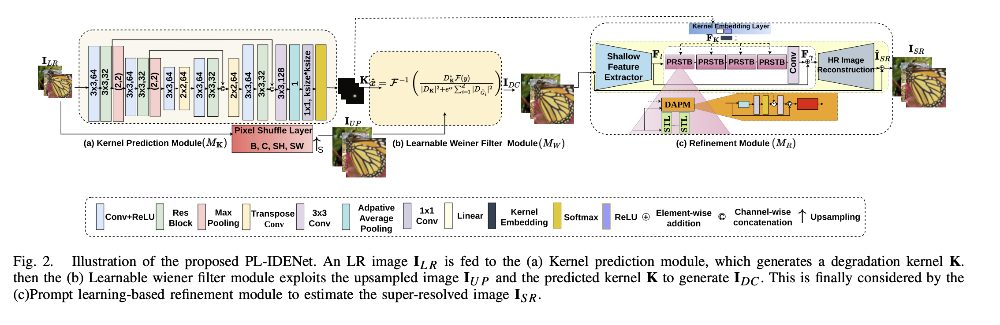

## Lightweight Prompt Learning Implicit Degradation Estimation Network for Blind Super Resolution
### [[Paper](https://ieeexplore.ieee.org/stamp/stamp.jsp?arnumber=10639339)]
[Asif Hussain Khan](https://scholar.google.com/citations?user=L74TJA4AAAAJ&hl=it)\, [Christian Micheloni](https://scholar.google.com/citations?user=Gbnq0F8AAAAJ&hl=it)\, [Niki Martinel](https://scholar.google.com/citations?user=tSbe868AAAAJ&hl=it)

> **Abstract:**  Blind image super-resolution (SR) aims to recover
a high-resolution (HR) image from its low-resolution (LR) counterpart under the assumption of unknown degradations. Many
existing blind SR methods rely on supervising ground-truth
kernels referred to as explicit degradation estimators. However,
it is very challenging to obtain the ground-truths for different
degradations kernels. Moreover, most of these methods rely on
heavy backbone networks, which demand extensive computational resources. Implicit degradation estimators do not require
the availability of ground truth kernels, but they see a significant
performance gap with the explicit degradation estimators due
to such missing information. We present a novel approach that
significantly narrows such a gap by means of a lightweight
architecture that implicitly learns the degradation kernel with
the help of a novel loss component. The kernel is exploited by
a learnable Wiener filter that performs efficient deconvolution
in the Fourier domain by deriving a closed-form solution.
Inspired by prompt-based learning, we also propose a novel
degradation-conditioned prompt layer that exploits the estimated
kernel to drive the focus on the discriminative contextual information that guides the reconstruction process in recovering the
latent HR image. Extensive experiments under different degradation settings demonstrate that our model, named PL-IDENet,
yields PSNR and SSIM improvements of more than 0.4d B and
1.3%, and 1.4d B and 4.8% to the best implicit and explicit
blind-SR method, respectively. These results are achieved while
maintaining a substantially lower number of parameters/FLOPs
(i.e., 25% and 68% fewer parameters than best implicit and
explicit methods, respectively).

    

