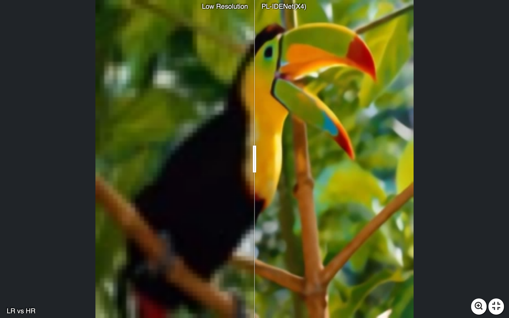
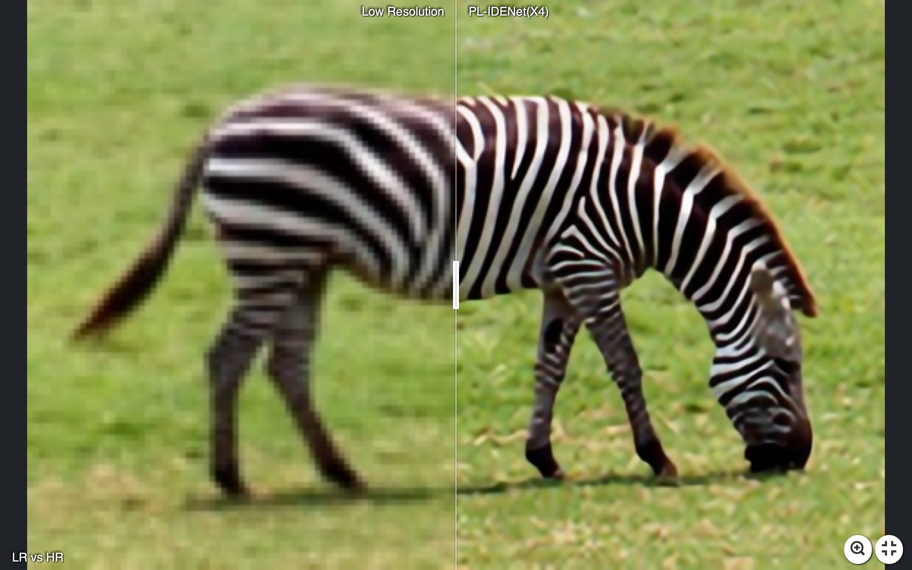
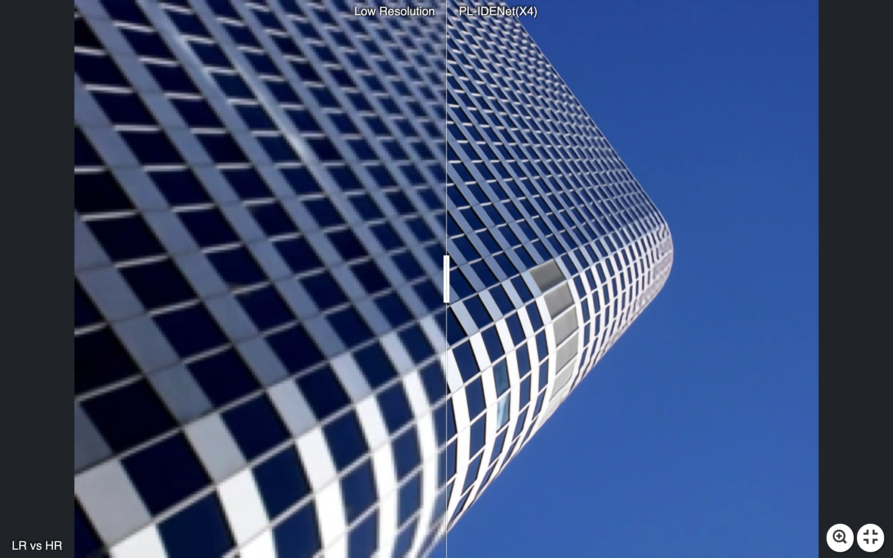
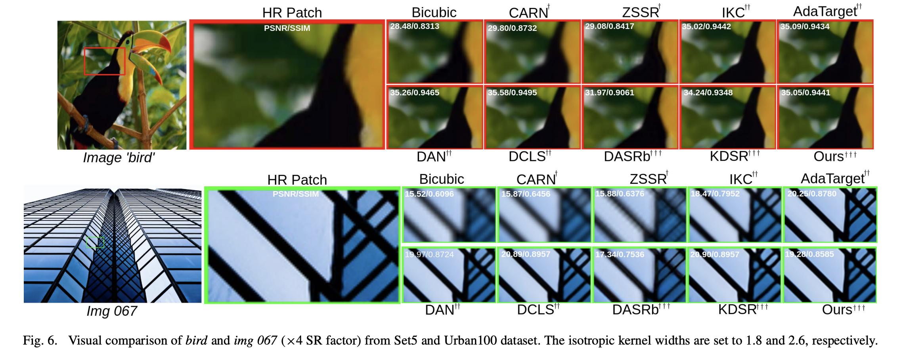
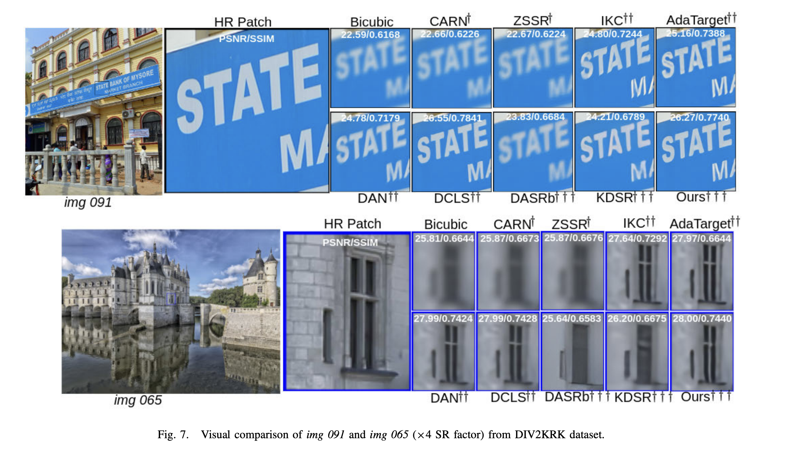
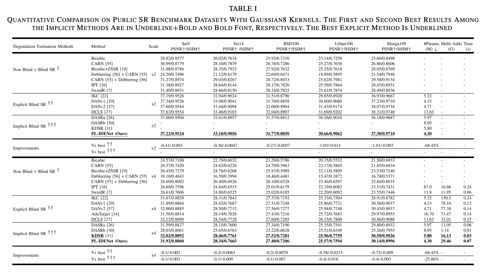
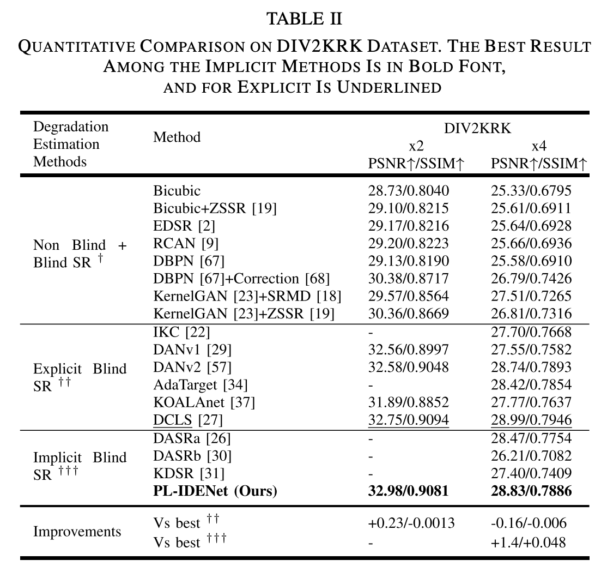

## [TIP24] Lightweight Prompt Learning Implicit Degradation Estimation Network for Blind Super Resolution


---
### [[Paper](https://ieeexplore.ieee.org/stamp/stamp.jsp?arnumber=10639339)]
[Asif Hussain Khan](https://scholar.google.com/citations?user=L74TJA4AAAAJ&hl=it)\, [Christian Micheloni](https://scholar.google.com/citations?user=Gbnq0F8AAAAJ&hl=it)\, [Niki Martinel](https://scholar.google.com/citations?user=tSbe868AAAAJ&hl=it)


#✨ _**Visual examples**_:


[](https://imgsli.com/MzA0MTYw)[](https://imgsli.com/MzA0MTc0)[](https://imgsli.com/MzA0MTg2)


[](https://imgsli.com/MzA0MjEx)[](https://imgsli.com/MzA0MjE1)[](https://imgsli.com/MzA0MjE4)


> **Abstract:**  Blind image super-resolution (SR) aims to recover
a high-resolution (HR) image from its low-resolution (LR) counterpart under the assumption of unknown degradations. Many
existing blind SR methods rely on supervising ground-truth
kernels referred to as explicit degradation estimators. However,
it is very challenging to obtain the ground-truths for different
degradations kernels. Moreover, most of these methods rely on
heavy backbone networks, which demand extensive computational resources. Implicit degradation estimators do not require
the availability of ground truth kernels, but they see a significant
performance gap with the explicit degradation estimators due
to such missing information. We present a novel approach that
significantly narrows such a gap by means of a lightweight
architecture that implicitly learns the degradation kernel with
the help of a novel loss component. The kernel is exploited by
a learnable Wiener filter that performs efficient deconvolution
in the Fourier domain by deriving a closed-form solution.
Inspired by prompt-based learning, we also propose a novel
degradation-conditioned prompt layer that exploits the estimated
kernel to drive the focus on the discriminative contextual information that guides the reconstruction process in recovering the
latent HR image. Extensive experiments under different degradation settings demonstrate that our model, named PL-IDENet,
yields PSNR and SSIM improvements of more than 0.4d B and
1.3%, and 1.4d B and 4.8% to the best implicit and explicit
blind-SR method, respectively. These results are achieved while
maintaining a substantially lower number of parameters/FLOPs
(i.e., 25% and 68% fewer parameters than best implicit and
explicit methods, respectively).
<p align="center">
    
</p>

⭐If this work is helpful for you, please help star this repo. Thanks!🤗


## 📑 Contents

- [Visual Results](#visual_results)
- [Model Summary](#model_summary)
- [Results](#results)
- [Installation](#installation)
- [Training](#training)
- [Testing](#testing)
- [Citation](#cite)

## <a name="Real-SR"></a>🔍 Visual Results On Setting1 (Isotropic Guassian Kernels) 
<p align="center">
  
</p>

## <a name="Real-SR"></a>🔍 Visual Results On Setting2 (AnIsotropic Guassian Kernels) 
<p align="center">
  
</p>

## <a name="model_summary"></a> :page_with_curl: Model Summary

| Model          | Task                 | Test_dataset | PSNR  | SSIM   | model_weights | 
|----------------|----------------------|--------------|-------|--------| --------- |
| x2_PL_IDENet_Setting1    | Isotropic        | Set5/Set14/BSDS100/Urban100/Manga109     | 37.22/33.10/31.77/30.66/37.30 | 0.9524/0.9056/0.8850/0.9062/0.9710 | [link](https://drive.google.com/open?id=1HqcTHEKmjoR6JcGXjaK-XJcU996Hv7xF&usp=drive_fsg)      
| x4_PL_IDENet_Setting1    | Isotropic        | Set5/Set14/BSDS100/Urban100/Manga109     | 31.92/28.34/27.40/25.57/30.14 | 0.8860/0.7665/0.7206/0.7594/0.8996 | [link](https://drive.google.com/open?id=1HqcTHEKmjoR6JcGXjaK-XJcU996Hv7xF&usp=drive_fs)     
| x2_PL_IDENet_Setting2    | Anisotropic       | DIV2KRK     | 32.98 | 0.9081 | [link](https://drive.google.com/open?id=1HqcTHEKmjoR6JcGXjaK-XJcU996Hv7xF&usp=drive_fs)      
| x4_PL_IDENet_Setting2 | Anisotropic    | DIV2KRK     | 28.82 | 0.7886 | [link](https://drive.google.com/open?id=1HqcTHEKmjoR6JcGXjaK-XJcU996Hv7xF&usp=drive_fs)   

## <a name="results"></a> 🥇 Results

We achieve state-of-the-art performance on various image restoration tasks. Detailed results can be found in the paper.


<details>
<summary>Evaluation on Setting1 (click to expand)</summary>

<p align="center">
  
</p>
</details>


<details>
<summary>Evaluation on Seting2 (click to expand)</summary>

<p align="center">
  
</p>


## <a name="installation"></a> :wrench: Installation

Create a conda environment with the following simple commands:
```
conda env create -f rsmodel.yaml
conda activate rsmodel
```
## Datasets

The datasets used in our training and testing are orgnized as follows: 


| Task                                          |                         Training Set                         |                         Testing Set                          |                        Visual Results                        |
| :-------------------------------------------- | :----------------------------------------------------------: | :----------------------------------------------------------: | :----------------------------------------------------------: |
| Setting1                                      | [DIV2K](https://data.vision.ee.ethz.ch/cvl/DIV2K/) (800 training images) +  [Flickr2K](https://cv.snu.ac.kr/research/EDSR/Flickr2K.tar) (2650 images) [complete dataset DF2K [download](https://drive.google.com/file/d/1TubDkirxl4qAWelfOnpwaSKoj3KLAIG4/view?usp=share_link)] | Set5 + Set14 + BSD100 + Urban100 + Manga109 [[download](https://drive.google.com/file/d/1n-7pmwjP0isZBK7w3tx2y8CTastlABx1/view?usp=sharing)] | [Dropbox](https://www.dropbox.com/scl/fo/21uf1uffr9lo0ia93beay/ANyWPKSBc7glbEdew8DRUaI?rlkey=a7lpq8zchlhlcgmtf57tff3r8&dl=0) |
| Setting2                          | [DIV2K](https://data.vision.ee.ethz.ch/cvl/DIV2K/) (800 training images) +  [Flickr2K](https://cv.snu.ac.kr/research/EDSR/Flickr2K.tar) (2650 images)[download](https://drive.google.com/file/d/1jPgG_URDQZ4kyXaMMXJ8AZ8jEErCdKuM/view?usp=share_link)] | DIV2KRK  [[download](https://github.com/sefibk/KernelGAN)] | [Dropbox](https://www.dropbox.com/scl/fo/21uf1uffr9lo0ia93beay/ANyWPKSBc7glbEdew8DRUaI?rlkey=a7lpq8zchlhlcgmtf57tff3r8&dl=0) |

## <a name="training"></a>  :hourglass: Training

We use DIV2K and Flickr2K as our training datasets (total 3450 images).
### For Setting 1
Change the yaml file path in the train.py file 
```
cd train
python train.py
```
### For Setting 2
Change the yaml file path in the train.py file 
```
cd train
python train.py
```

## <a name="training"></a>  :hourglass: Evaluation

We use Set5, Set14, BSDS100, Urban100 and Manga109 for Setting 1.
Use the following script to generate the LR Blur images and convert them into binary.

```
cd scripts
python generate_mod_blur_LR_bic.py

cd scripts
python create_lmdb.py
```

Change the yaml file path in the test.py file 
```
cd test
python test.py
```
We use DIV2kRK for Setting 2
.Use the following script to convert them into binary
```
cd scripts
python create_lmdb.py
```

Change the yaml file path in the test.py file 
```
cd test
python test.py
```
## <a name="cite"></a> 🥰 Citation

Please cite us if our work is useful for your research.

```
@article{khan2024lightweight,
  title={Lightweight Prompt Learning Implicit Degradation Estimation Network for Blind Super Resolution},
  author={Khan, Asif Hussain and Micheloni, Christian and Martinel, Niki},
  journal={IEEE Transactions on Image Processing},
  year={2024},
  publisher={IEEE}
}
```
## Acknowledgement
This project is based on [[DAN](https://github.com/greatlog/DAN)], [[DCLS](https://github.com/megvii-research/DCLS-SR)] and [[SRResCGAN](https://github.com/RaoUmer/SRResCGAN)].
